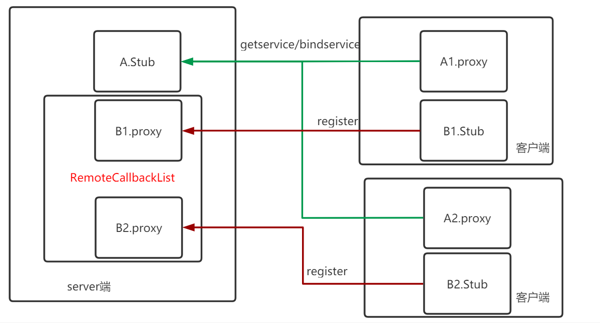

### DeathRecipient
DeathRecipient类的作用，当Binder服务端程序挂掉了，通知给Binder客户端程序，binder服务端程序挂掉后，kernel会调用binder_release函数，发送死亡通知给绑定的Binder代理对象

```java
public interface DeathRecipient {
    public void binderDied();
}
```

### Android系统中的使用案列
```java
public final class ActivityManagerService {
    private final boolean attachApplicationLocked(IApplicationThread thread, int pid) {

        //创建IBinder.DeathRecipient子类对象
        AppDeathRecipient adr = new AppDeathRecipient(app, pid, thread);
        //建立binder死亡回调
        thread.asBinder().linkToDeath(adr, 0);

    }

    private final class AppDeathRecipient implements IBinder.DeathRecipient {

        public void binderDied() {
            synchronized(ActivityManagerService.this) {
                appDiedLocked(mApp, mPid, mAppThread, true);
            }
        }
    }
}
```

### 自定义服务中的使用案列
```java
final IBinder.DeathRecipient deathRecipient = new IBinder.DeathRecipient() {
    @Override
    public void binderDied() {
        // 服务器进程死亡
        Log.d(TAG, "binderDied");
    }
};

ServiceConnection connection = new ServiceConnection() {
    @Override
    public void onServiceConnected(ComponentName name, final IBinder service) {
        mIMyAidlInterface = IMyAidlInterface.Stub.asInterface(service);
        if (mIMyAidlInterface != null) {
            new Handler().post(new Runnable() {
                @Override
                public void run() {
                    try {
                        //建立binder死亡回调，当自定义服务进程挂掉后，回调DeathRecipient的binderDied函数
                        mIMyAidlInterface.asBinder().linkToDeath(deathRecipient, 0);
                    } catch (RemoteException e) {
                        e.printStackTrace();
                    }
                }
            });
        }
    }


    @Override
    public void onServiceDisconnected(ComponentName name) {
        mIMyAidlInterface = null;
    }
};
```

```java
bindService(new Intent(this, MyService.class), connection, Context.BIND_AUTO_CREATE);
```

### linkToDeath
Binder的实现为空实现,因为服务端进程自己挂没有挂，自己最清楚， 不需要来注册函数，就算linkToDeath函数能注册，服务端进程挂掉后，linkToDeath函数也没有机会执行了死亡通知是为了BinderProxy对象则需要知道服务端进程是否死亡的生死情况
```java
public class Binder implements IBinder {
    public void linkToDeath(DeathRecipient recipient, int flags) {
    }

    public boolean unlinkToDeath(DeathRecipient recipient, int flags) {
        return true;
    }
}

final class BinderProxy implements IBinder {
    // 向Binder驱动注册死亡回调
    public native void linkToDeath(DeathRecipient recipient, int flags) throws RemoteException;
    public native boolean unlinkToDeath(DeathRecipient recipient, int flags);
}
```

### RemoteCallbackList
在某些场景下,Binder服务端需要回调每一个Binder代理对象对应的回调接口,要先确保Binder代理对象没有死亡，才发送，RemoteCallbackList内部是通过DeathRecipient和匿名Binder来实现的<br>

以A,B接口来举例，客服端先获取A接口的Binder代理对象， 每一个客服端都创建一个实现了B接口的Binder服务对象，通过A接口，把实现了B接口的Binder服务对象传给A，通过kernel层的转换，A服务中最终获取到的是B接口的代理对象



```java
public interface IInterface
{
    public IBinder asBinder();
}
```

```java
public class RemoteCallbackList<E extends IInterface> {
    public boolean register(E callback, Object cookie) {
        synchronized (mCallbacks) {
            if (mKilled) {
                return false;
            }
            // Flag unusual case that could be caused by a leak. b/36778087
            logExcessiveCallbacks();
            IBinder binder = callback.asBinder();
            try {
                Callback cb = new Callback(callback, cookie);、
                // 最终也是通过linkToDeath实现
                binder.linkToDeath(cb, 0);
                mCallbacks.put(binder, cb);
                return true;
            } catch (RemoteException e) {
                return false;
            }
        }
    }
}
```

```java
// example IInterface接口为android.os.IInterface，需要Binder通信的接口类才符合IInterface接口
public interface IMyAidlInterface extends android.os.IInterface {}
    public static abstract class Stub extends android.os.Binder implements com.hhtc.deathrecipient.IMyAidlInterface {}

    private static class Proxy implements com.hhtc.deathrecipient.IMyAidlInterface {}
}
```
