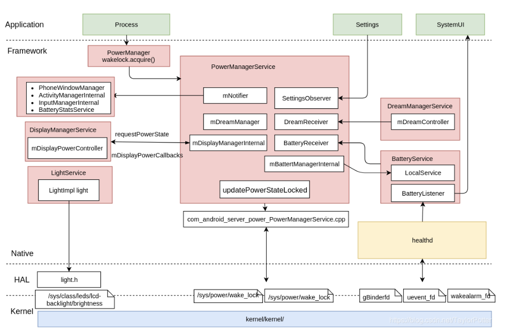

PowerManagerService是负责管理、协调设备电源管理的系统服务之一，它在Framework层建立起一个策略控制方案，向下决策HAL层以及kernel层来控制设备待机状态，控制显示屏，背光灯，距离传感器，光线传感器等硬件设备的状态。

Android的电源管理主要是通过wakelock机制来管理系统的状态，整个android电源管理，可以分为四个层次：
- 应用接口层（PowerManager.java）
- Framework层（PowerManagerService.java）
- HAL层（Power.c)
- 内核层（kernel/Power）




### PowerManagerService一些重要成员变量介绍
|  变量名   | 介绍  |
|  ----  | ----  |
| mDirty  | 记录电源状态有哪些部分已更改,需要更新 |
| mWakefulness  | 记录设备电源状态 |
| mWakeLockSuspendBlocker  |  CPU锁 |
| mDisplaySuspendBlocker  | 屏幕锁 |
| mWakeLocks  | 应用程序获取的所有唤醒锁数组 |
| mWakeLockSummary  | 所有有效的锁的bit位组合 |
| mUserActivitySummary  | 用户活动计时器bit位组合 |
| mNotifier  | 电源状态改变， 发送相应的通知等 |

<br><br>

##### mWakefulness有如下四种状态
```java
// 休眠状态
public static final int WAKEFULNESS_ASLEEP = 0;
// 亮屏状态
public static final int WAKEFULNESS_AWAKE = 1;
// 屏保状态
public static final int WAKEFULNESS_DREAMING = 2;
// 打盹状态
public static final int WAKEFULNESS_DOZING = 3;
```


## PowerManagerService初始化
PowerManagerService的初始化主要涉及到两个函数，PowerManagerService构造函数和systemReady函数<br>
PowerManagerService构造函数所完成的工作如下：
- 1 创建ServiceThread和PowerManagerHandler(PowerManagerHandler用来处理用户活动超时，屏保，长锁检测等)
- 2 电池信息相关的初始化，电池状态的记录
- 3 创建CPU和屏幕锁
- 4 获取屏幕锁，不让屏幕关闭
- 5 设置mWakefulness为亮屏状态

```java
public PowerManagerService(Context context) {
	super(context);
	mContext = context;
	mHandlerThread = new ServiceThread(TAG,
			Process.THREAD_PRIORITY_DISPLAY, false /*allowIo*/);
	mHandlerThread.start();
	// PowerManagerHandler 处理用户活动超时，屏保， 长锁检测
	mHandler = new PowerManagerHandler(mHandlerThread.getLooper());

	// 电池信息相关的初始化
	mBatterySavingStats = new BatterySavingStats(mLock);
	mBatterySaverPolicy = new BatterySaverPolicy(mLock, mContext, mBatterySavingStats);
	mBatterySaverController = new BatterySaverController(mLock, mContext,
			BackgroundThread.get().getLooper(), mBatterySaverPolicy, mBatterySavingStats);
	mBatterySaverStateMachine = new BatterySaverStateMachine(
			mLock, mContext, mBatterySaverController);

	synchronized (mLock) {
		// new cpu锁
		mWakeLockSuspendBlocker = createSuspendBlockerLocked("PowerManagerService.WakeLocks");
		// new 屏幕锁
		mDisplaySuspendBlocker = createSuspendBlockerLocked("PowerManagerService.Display");
		// 获取屏幕锁，不让屏幕关闭
		mDisplaySuspendBlocker.acquire();
		mHoldingDisplaySuspendBlocker = true;
		mHalAutoSuspendModeEnabled = false;
		mHalInteractiveModeEnabled = true;
		// 设置状态为亮屏状态
		mWakefulness = WAKEFULNESS_AWAKE;

		sQuiescent = SystemProperties.get(SYSTEM_PROPERTY_QUIESCENT, "0").equals("1");
		// 初始化 powerHal
		nativeInit();
	}
}
```

<br><br><br><br>

PowerManagerService::systemReady函数所完成的工作如下：
- 1 屏保服务获取
- 2 显示服务获取
- 3 给mPolicy赋值(mPolicy == PhoneWindowManager)
- 4 电池服务获取
- 5 mNotifier对象创建
- 6 灯光服务获取
- 7 初始化显示器电源
- 8 读取配置信息， 更新配置信息
- 9 更新电源状态(updatePowerStateLocked方法是整个PMS中的核心方法)
- 10 注册设置改变的监听事件
- 11 注册屏保，电池状态改变等广播事件

```java
public void systemReady(IAppOpsService appOps) {
	synchronized (mLock) {
		mSystemReady = true;
		mAppOps = appOps;
		// 屏保服务获取
		mDreamManager = getLocalService(DreamManagerInternal.class);
		// 显示服务获取
		mDisplayManagerInternal = getLocalService(DisplayManagerInternal.class);
		// mPolicy = PhoneWindowManager
		mPolicy = getLocalService(WindowManagerPolicy.class);
		// 电池服务获取
		mBatteryManagerInternal = getLocalService(BatteryManagerInternal.class);


		mBatteryStats = BatteryStatsService.getService();
		// 用于通知系统中电源状态的改变
		mNotifier = new Notifier(Looper.getMainLooper(), mContext, mBatteryStats,
				createSuspendBlockerLocked("PowerManagerService.Broadcasts"), mPolicy);
		mWirelessChargerDetector = new WirelessChargerDetector(sensorManager,
				createSuspendBlockerLocked("PowerManagerService.WirelessChargerDetector"),
				mHandler);
		mSettingsObserver = new SettingsObserver(mHandler);
		// 灯光服务获取
		mLightsManager = getLocalService(LightsManager.class);
		mAttentionLight = mLightsManager.getLight(LightsManager.LIGHT_ID_ATTENTION);

		// Initialize display power management.
		// 初始化显示器电源
		mDisplayManagerInternal.initPowerManagement(
				mDisplayPowerCallbacks, mHandler, sensorManager);

		try {
			final ForegroundProfileObserver observeupdateIsPoweredLockedr = new ForegroundProfileObserver();
			ActivityManager.getService().registerUserSwitchObserver(observer, TAG);
		} catch (RemoteException e) {
			// Shouldn't happen since in-process.
		}

		// Go.
		// 读取配置信息
		readConfigurationLocked();
		// 更新配置信息
		updateSettingsLocked();
		mDirty |= DIRTY_BATTERY_STATE;
		// 更新电源状态
		updatePowerStateLocked();
	}

	final ContentResolver resolver = mContext.getContentResolver();
	mConstants.start(resolver);

	mBatterySaverController.systemReady();
	mBatterySaverPolicy.systemReady();

	// Register for settings changes.
	// 监听setting数据库的某些字段变化
	resolver.registerContentObserver(Settings.Secure.getUriFor(
			Settings.Secure.SCREENSAVER_ENABLED),
			false, mSettingsObserver, UserHandle.USER_ALL);


	// Register for broadcasts from other components of the system.
	// 注册监听电池相关信息改变， 屏保等广播
	IntentFilter filter = new IntentFilter();
	filter.addAction(Intent.ACTION_BATTERY_CHANGED);
	filter.setPriority(IntentFilter.SYSTEM_HIGH_PRIORITY);
	mContext.registerReceiver(new BatteryReceiver(), filter, null, mHandler);

	filter = new IntentFilter();
	filter.addAction(Intent.ACTION_DREAMING_STARTED);
	filter.addAction(Intent.ACTION_DREAMING_STOPPED);
	mContext.registerReceiver(new DreamReceiver(), filter, null, mHandler);

	filter = new IntentFilter();
	filter.addAction(Intent.ACTION_USER_SWITCHED);
	mContext.registerReceiver(new UserSwitchedReceiver(), filter, null, mHandler);

	filter = new IntentFilter();
	filter.addAction(Intent.ACTION_DOCK_EVENT);
	mContext.registerReceiver(new DockReceiver(), filter, null, mHandler);
}
```

### updatePowerStateLocked
updatePowerStateLocked方法是整个PMS中的核心方法，它用来更新整个电源状态的改变。PMS中使用一个int值mDirty作为标志位判断电源状态是否发生变化，当电源状态发生改变时，如亮灭屏、电池状态改变、暗屏等都会调用该方法
PowerManagerService::updatePowerStateLocked函数所完成的工作如下：
- 1 充电以及电池状态更新，插拔电源会亮屏在这里更新
- 2 更新 mStayOn
- 3 更新统计wakelock的标记值到mWakeLockSummary
- 4 更新mUserActivitySummary和重新计算休眠到达时间
- 5 更新mWakefulness状态 （休眠，唤醒，屏保， 打盹）
- 6 更新显示服务相关信息， 没有具体分析， 涉及到显示相关服务
- 7 更新屏保状态
- 8 通过mNotifier发送相关状态变化广播和回调相关接口
- 9 根据mWakeLockSummary的bit位来判断是否需要释放CPU锁（updateSuspendBlockerLocked）
- 10 根据显示服务是否需要释放或者获取屏幕锁（updateSuspendBlockerLocked）
```java
private void updatePowerStateLocked() {
  // 系统没有ready 或者mDirty没有bit位更新，直接返回
  if (!mSystemReady || mDirty == 0) {
        return;
    }

    try {
        // Phase 0: Basic state updates.
        // 0 充电以及电池状态更新
        updateIsPoweredLocked(mDirty);
        // 0 更新 mStayOn
        updateStayOnLocked(mDirty);
        // 0
        updateScreenBrightnessBoostLocked(mDirty);

        // Phase 1: Update wakefulness.
        // Loop because the wake lock and user activity computations are influenced
        // by changes in wakefulness.
        final long now = SystemClock.uptimeMillis();
        int dirtyPhase2 = 0;
        // 1 循环最多跑两次
        for (;;) {
            int dirtyPhase1 = mDirty;
            dirtyPhase2 |= dirtyPhase1;
            // 1 清除mDirty bit位
            mDirty = 0;
            // 1 更新统计wakelock的标记值到mWakeLockSummary
            updateWakeLockSummaryLocked(dirtyPhase1);
            // 1 更新mUserActivitySummary和重新计算休眠到达时间
            updateUserActivitySummaryLocked(now, dirtyPhase1);
            // 1 根据dirtyPhase1更新 mWakefulness （休眠，唤醒，或其他状态）
            if (!updateWakefulnessLocked(dirtyPhase1)) {
                break;
            }
        }

        // Phase 2: Lock profiles that became inactive/not kept awake.
        updateProfilesLocked(now);

        // Phase 3: Update display power state.
        // 3 更新显示服务相关信息， 没有具体分析， 涉及到显示相关服务
        final boolean displayBecameReady = updateDisplayPowerStateLocked(dirtyPhase2);

        // Phase 4: Update dream state (depends on display ready signal).
        // 4 更新屏保状态
        updateDreamLocked(dirtyPhase2, displayBecameReady);

        // Phase 5: Send notifications, if needed.
        // 5 当mWakefulness改变时，发送相应的广播
        finishWakefulnessChangeIfNeededLocked();

        // Phase 6: Update suspend blocker.
        // Because we might release the last suspend blocker here, we need to make sure
        // we finished everything else first!
       // 6 获取或者释放cpu锁和屏幕锁
        updateSuspendBlockerLocked();
    } finally {
        Trace.traceEnd(Trace.TRACE_TAG_POWER);
    }
}
```

### updateIsPoweredLocked
PowerManagerService::updateIsPoweredLocked函数所完成的工作如下：
- 1 DIRTY_BATTERY_STATE bit位为1才进条件
- 2 通过电池服务获取电池信息，是否在充电
- 3 是否需要唤醒屏幕
- 4 更新active时间 回调PhoneWindowManager的onUserActivity函数
- 5 将电池状态信息保存到mBatterySaverStateMachine中
```java
private void updateIsPoweredLocked(int dirty) {
	if ((dirty & DIRTY_BATTERY_STATE) != 0) {
		final boolean wasPowered = mIsPowered;
		final int oldPlugType = mPlugType;
		final boolean oldLevelLow = mBatteryLevelLow;
		// 是否充电
		mIsPowered = mBatteryManagerInternal.isPowered(BatteryManager.BATTERY_PLUGGED_ANY);
		// 充电类型
		mPlugType = mBatteryManagerInternal.getPlugType();
		// 电池电量
		mBatteryLevel = mBatteryManagerInternal.getBatteryLevel();
		// 是否低电量
		mBatteryLevelLow = mBatteryManagerInternal.getBatteryLevelLow();
		// 是否和上次充电状态不一样或者充电类型不同
		if (wasPowered != mIsPowered || oldPlugType != mPlugType) {
			mDirty |= DIRTY_IS_POWERED;

			// Update wireless dock detection state.
			final boolean dockedOnWirelessCharger = mWirelessChargerDetector.update(
					mIsPowered, mPlugType);

			// Treat plugging and unplugging the devices as a user activity.
			// Users find it disconcerting when they plug or unplug the device
			// and it shuts off right away.
			// Some devices also wake the device when plugged or unplugged because
			// they don't have a charging LED.
			final long now = SystemClock.uptimeMillis();
			if (shouldWakeUpWhenPluggedOrUnpluggedLocked(wasPowered, oldPlugType,
					dockedOnWirelessCharger)) {
				// 插拔充电线，唤醒屏幕
				wakeUpNoUpdateLocked(now, "android.server.power:POWER", Process.SYSTEM_UID,
						mContext.getOpPackageName(), Process.SYSTEM_UID);
			}
			// 更新active时间 回调PhoneWindowManager的onUserActivity(event, uid)函数
			userActivityNoUpdateLocked(
					now, PowerManager.USER_ACTIVITY_EVENT_OTHER, 0, Process.SYSTEM_UID);

		}
		// 更新电池相关信息到mBatterySaverStateMachine中
		mBatterySaverStateMachine.setBatteryStatus(mIsPowered, mBatteryLevel, mBatteryLevelLow);
	}
}
```

### updateWakeLockSummaryLocked
将mWakeLocks的bit位合并到mWakeLockSummary中，通过adjustWakeLockSummaryLocked函数来进一步调整bit位
```java
private void updateWakeLockSummaryLocked(int dirty) {
	if ((dirty & (DIRTY_WAKE_LOCKS | DIRTY_WAKEFULNESS)) != 0) {
		mWakeLockSummary = 0;
		final int numWakeLocks = mWakeLocks.size();
		for (int i = 0; i < numWakeLocks; i++) {
			final WakeLock wakeLock = mWakeLocks.get(i);
			// 获取锁的标志位
			final int wakeLockFlags = getWakeLockSummaryFlags(wakeLock);
			// 合并到mWakeLockSummary中
			mWakeLockSummary |= wakeLockFlags;
		}

		mWakeLockSummary = adjustWakeLockSummaryLocked(mWakeLockSummary);
	}
}
```

### adjustWakeLockSummaryLocked
```java
private int adjustWakeLockSummaryLocked(int wakeLockSummary) {
    // Cancel wake locks that make no sense based on the current state.
    if (mWakefulness != WAKEFULNESS_DOZING) {
        // 不是WAKEFULNESS_DOZING 清除WAKE_LOCK_DOZE和WAKE_LOCK_DRAW bit位
        wakeLockSummary &= ~(WAKE_LOCK_DOZE | WAKE_LOCK_DRAW);
    }
    if (mWakefulness == WAKEFULNESS_ASLEEP
            || (wakeLockSummary & WAKE_LOCK_DOZE) != 0) {
        // 清除屏幕显示相关的bit位
        wakeLockSummary &= ~(WAKE_LOCK_SCREEN_BRIGHT | WAKE_LOCK_SCREEN_DIM
                | WAKE_LOCK_BUTTON_BRIGHT);
        if (mWakefulness == WAKEFULNESS_ASLEEP) {
            // 清除Psensor关屏标识
            wakeLockSummary &= ~WAKE_LOCK_PROXIMITY_SCREEN_OFF;
        }
    }

    // Infer implied wake locks where necessary based on the current state.
    if ((wakeLockSummary & (WAKE_LOCK_SCREEN_BRIGHT | WAKE_LOCK_SCREEN_DIM)) != 0) {
        if (mWakefulness == WAKEFULNESS_AWAKE) {
            // 系统是wake状态，需要获取WAKE_LOCK_CPU和WAKE_LOCK_STAY_AWAKE bit位置1
            wakeLockSummary |= WAKE_LOCK_CPU | WAKE_LOCK_STAY_AWAKE;
        } else if (mWakefulness == WAKEFULNESS_DREAMING) {
            // 屏保状态
            wakeLockSummary |= WAKE_LOCK_CPU;
        }
    }
    if ((wakeLockSummary & WAKE_LOCK_DRAW) != 0) {
        wakeLockSummary |= WAKE_LOCK_CPU;
    }

    return wakeLockSummary;
}
```

### updateUserActivitySummaryLocked
用户过段时间没有操作屏幕或按键， 屏幕会关闭，检测超时时间是否需要重新计算或者时间已经过去，通过updateUserActivitySummaryLocked来更新，只有当屏幕是亮的时候，才需要计算。

```java
private void updateUserActivitySummaryLocked(long now, int dirty) {
	// Update the status of the user activity timeout timer.
	// 更新用户活动超时时间
	if ((dirty & (DIRTY_WAKE_LOCKS | DIRTY_USER_ACTIVITY
			| DIRTY_WAKEFULNESS | DIRTY_SETTINGS)) != 0) {
		mHandler.removeMessages(MSG_USER_ACTIVITY_TIMEOUT);

		long nextTimeout = 0;
		// mWakefulness 是休眠模式不会进入if条件
		if (mWakefulness == WAKEFULNESS_AWAKE
				|| mWakefulness == WAKEFULNESS_DREAMING
				|| mWakefulness == WAKEFULNESS_DOZING) {
			final long sleepTimeout = getSleepTimeoutLocked();
			final long screenOffTimeout = getScreenOffTimeoutLocked(sleepTimeout);
			final long screenDimDuration = getScreenDimDurationLocked(screenOffTimeout);
			final boolean userInactiveOverride = mUserInactiveOverrideFromWindowManager;
			final long nextProfileTimeout = getNextProfileTimeoutLocked(now);

			mUserActivitySummary = 0;
			// 亮屏
			if (mLastUserActivityTime >= mLastWakeTime) {
				nextTimeout = mLastUserActivityTime
						+ screenOffTimeout - screenDimDuration;
				// 当前时间小于超时时间， 屏幕还是亮的
				if (now < nextTimeout) {
					mUserActivitySummary = USER_ACTIVITY_SCREEN_BRIGHT;
				} else {
					nextTimeout = mLastUserActivityTime + screenOffTimeout;
					if (now < nextTimeout) {
						// 处在超时和dim中间的时间段
						mUserActivitySummary = USER_ACTIVITY_SCREEN_DIM;
					}
				}
			}
			if (mUserActivitySummary == 0
					&& mLastUserActivityTimeNoChangeLights >= mLastWakeTime) {
				// nextTimeout = 上次唤醒时间加屏幕超时时间
				nextTimeout = mLastUserActivityTimeNoChangeLights + screenOffTimeout;
				if (now < nextTimeout) {
					// 根据mDisplayPowerRequest 状态设置mUserActivitySummary
					if (mDisplayPowerRequest.policy == DisplayPowerRequest.POLICY_BRIGHT
							|| mDisplayPowerRequest.policy == DisplayPowerRequest.POLICY_VR) {
						mUserActivitySummary = USER_ACTIVITY_SCREEN_BRIGHT;
					} else if (mDisplayPowerRequest.policy == DisplayPowerRequest.POLICY_DIM) {
						mUserActivitySummary = USER_ACTIVITY_SCREEN_DIM;
					}
				}
			}

			// 屏保相关状态
			if (mUserActivitySummary == 0) {
				if (sleepTimeout >= 0) {
					final long anyUserActivity = Math.max(mLastUserActivityTime,
							mLastUserActivityTimeNoChangeLights);
					if (anyUserActivity >= mLastWakeTime) {
						nextTimeout = anyUserActivity + sleepTimeout;
						if (now < nextTimeout) {
							mUserActivitySummary = USER_ACTIVITY_SCREEN_DREAM;
						}
					}
				} else {
					mUserActivitySummary = USER_ACTIVITY_SCREEN_DREAM;
					nextTimeout = -1;
				}
			}

			if (mUserActivitySummary != USER_ACTIVITY_SCREEN_DREAM && userInactiveOverride) {
				if ((mUserActivitySummary &
						(USER_ACTIVITY_SCREEN_BRIGHT | USER_ACTIVITY_SCREEN_DIM)) != 0) {
					// Device is being kept awake by recent user activity
					if (nextTimeout >= now && mOverriddenTimeout == -1) {
						// Save when the next timeout would have occurred
						mOverriddenTimeout = nextTimeout;
					}
				}
				mUserActivitySummary = USER_ACTIVITY_SCREEN_DREAM;
				nextTimeout = -1;
			}

			if (nextProfileTimeout > 0) {
				nextTimeout = Math.min(nextTimeout, nextProfileTimeout);
			}

			if (mUserActivitySummary != 0 && nextTimeout >= 0) {
				// 重新计算下次超时时间，超时从新调用updatePowerStateLocked函数
				// scheduleUserInactivityTimeout
				//  mDirty |= DIRTY_USER_ACTIVITY;
				//  updatePowerStateLocked();
				scheduleUserInactivityTimeout(nextTimeout);
			}
		} else {
			mUserActivitySummary = 0;
		}
	}
}
```
### updateWakefulnessLocked
isItBedTimeYetLocked函数检测系统是否能休眠，通过shouldNapAtBedTimeLocked函数判断是否设置了屏保，如果设置了，则通过napNoUpdateLocked函数把mWakefulness设置为WAKEFULNESS_DREAMING模式,否则通过goToSleepNoUpdateLocked设置为WAKEFULNESS_DOZING模式
```java
private boolean updateWakefulnessLocked(int dirty) {
	boolean changed = false;
	// 当 dirty为0时，或条件不成立则退出
	// updatePowerStateLocked中的for循环判断updateWakefulnessLocked为false则退出循环
	if ((dirty & (DIRTY_WAKE_LOCKS | DIRTY_USER_ACTIVITY | DIRTY_BOOT_COMPLETED
			| DIRTY_WAKEFULNESS | DIRTY_STAY_ON | DIRTY_PROXIMITY_POSITIVE
			| DIRTY_DOCK_STATE)) != 0) {
		// isItBedTimeYetLocked 检测设备是否可以sleep (BedTime)
		if (mWakefulness == WAKEFULNESS_AWAKE && isItBedTimeYetLocked()) {
			if (DEBUG_SPEW) {
				Slog.d(TAG, "updateWakefulnessLocked: Bed time...");
			}
			final long time = SystemClock.uptimeMillis();
			// 是否设置了屏保
			if (shouldNapAtBedTimeLocked()) {
				// 进入屏保状态
				changed = napNoUpdateLocked(time, Process.SYSTEM_UID);
			} else {
				// 进入休眠状态
				changed = goToSleepNoUpdateLocked(time,
						PowerManager.GO_TO_SLEEP_REASON_TIMEOUT, 0, Process.SYSTEM_UID);
			}
		}
	}
	return changed;
}
```

### napNoUpdateLocked
```java
private boolean napNoUpdateLocked(long eventTime, int uid) {
	if (eventTime < mLastWakeTime || mWakefulness != WAKEFULNESS_AWAKE
			|| !mBootCompleted || !mSystemReady) {
		return false;
	}

	Trace.traceBegin(Trace.TRACE_TAG_POWER, "nap");
	try {
		Slog.i(TAG, "Nap time (uid " + uid +")...");

		mSandmanSummoned = true;
		// 设置为屏保状态 mWakefulness = WAKEFULNESS_DREAMING
		setWakefulnessLocked(WAKEFULNESS_DREAMING, 0);
	} finally {
		Trace.traceEnd(Trace.TRACE_TAG_POWER);
	}
	return true;
}
```

### setWakefulnessLocked
```java
void setWakefulnessLocked(int wakefulness, int reason) {
	if (mWakefulness != wakefulness) {
		mWakefulness = wakefulness;
		mWakefulnessChanging = true;
		mDirty |= DIRTY_WAKEFULNESS;
		if (mNotifier != null) {
			// 发送相应的状态改变的广播
			mNotifier.onWakefulnessChangeStarted(wakefulness, reason);
		}
	}
}
```

### goToSleepNoUpdateLocked
```java
private boolean goToSleepNoUpdateLocked(long eventTime, int reason, int flags, int uid) {
	if (eventTime < mLastWakeTime
			|| mWakefulness == WAKEFULNESS_ASLEEP
			|| mWakefulness == WAKEFULNESS_DOZING
			|| !mBootCompleted || !mSystemReady) {
		return false;
	}

	Trace.traceBegin(Trace.TRACE_TAG_POWER, "goToSleep");
	try {
		// 记录休眠时间
		mLastSleepTime = eventTime;
		mSandmanSummoned = true;
		// 设置为WAKEFULNESS_DOZING状态
		setWakefulnessLocked(WAKEFULNESS_DOZING, reason);


		// Skip dozing if requested.
		// 如果有PowerManager.GO_TO_SLEEP_FLAG_NO_DOZE flag 则直接跳过DOZING模式， 直接进入休眠模式
		if ((flags & PowerManager.GO_TO_SLEEP_FLAG_NO_DOZE) != 0) {
			reallyGoToSleepNoUpdateLocked(eventTime, uid);
		}
	} finally {
		Trace.traceEnd(Trace.TRACE_TAG_POWER);
	}
	return true;
}
```

### reallyGoToSleepNoUpdateLocked
```java
private boolean reallyGoToSleepNoUpdateLocked(long eventTime, int uid) {
	if (eventTime < mLastWakeTime || mWakefulness == WAKEFULNESS_ASLEEP
			|| !mBootCompleted || !mSystemReady) {
		return false;
	}

	Trace.traceBegin(Trace.TRACE_TAG_POWER, "reallyGoToSleep");
	try {
		Slog.i(TAG, "Sleeping (uid " + uid +")...");
		// 设置为休眠状态
		setWakefulnessLocked(WAKEFULNESS_ASLEEP, PowerManager.GO_TO_SLEEP_REASON_TIMEOUT);
	} finally {
		Trace.traceEnd(Trace.TRACE_TAG_POWER);
	}
	return true;
}
```

### updateDreamLocked
```java
private void updateDreamLocked(int dirty, boolean displayBecameReady) {
	if ((dirty & (DIRTY_WAKEFULNESS
			| DIRTY_USER_ACTIVITY
			| DIRTY_WAKE_LOCKS
			| DIRTY_BOOT_COMPLETED
			| DIRTY_SETTINGS
			| DIRTY_IS_POWERED
			| DIRTY_STAY_ON
			| DIRTY_PROXIMITY_POSITIVE
			| DIRTY_BATTERY_STATE)) != 0 || displayBecameReady) {
		if (mDisplayReady) {
			// 异步启动屏保
			scheduleSandmanLocked();
		}
	}
}
```

### scheduleSandmanLocked
```java
private void scheduleSandmanLocked() {
  // 如果已经计划屏保了， 则不做处理
  if (!mSandmanScheduled) {
		// 计划处理屏保位
    mSandmanScheduled = true;
		// 发送异步消息
		Message msg = mHandler.obtainMessage(MSG_SANDMAN);
		msg.setAsynchronous(true);
		mHandler.sendMessage(msg);
	}
}
```

```java
PowerManagerHandler
case MSG_SANDMAN:
    handleSandman();
```

### handleSandman
PowerManagerService::handleSandman函数所完成的工作如下：
- 1 通过canDreamLocked和canDozeLocked来判断可不可以启动屏保
- 2 如果可以启动屏保则启动屏保
- 3 记录当前电量信息
- 4 当前电量在屏保配置的范围内，继续屏保
- 5 不满足上面条件时，通过isItBedTimeYetLocked判断来设置为WAKEFULNESS_DOZING或者WAKEFULNESS_AWAKE模式
- 6 WAKEFULNESS_AWAKE模式时，则停止屏保
```java
// 运行在HandlerThread线程中
private void handleSandman() {
	// Handle preconditions.
	final boolean startDreaming;
	final int wakefulness;
	synchronized (mLock) {
		mSandmanScheduled = false;
		wakefulness = mWakefulness;
		// 判断是否可以启动屏保
		if (mSandmanSummoned && mDisplayReady) {
			startDreaming = canDreamLocked() || canDozeLocked();
			mSandmanSummoned = false;
		} else {
			startDreaming = false;
		}
	}

	// Start dreaming if needed.
	// We only control the dream on the handler thread, so we don't need to worry about
	// concurrent attempts to start or stop the dream.
	final boolean isDreaming;
	if (mDreamManager != null) {
		// Restart the dream whenever the sandman is summoned.
		if (startDreaming) {
			mDreamManager.stopDream(false /*immediate*/);
			// 启动屏保
			mDreamManager.startDream(wakefulness == WAKEFULNESS_DOZING);
		}
		isDreaming = mDreamManager.isDreaming();
	} else {
		isDreaming = false;
	}

	// Update dream state.
	synchronized (mLock) {
		// Remember the initial battery level when the dream started.
		if (startDreaming && isDreaming) {
			// 记录当前的电量
			mBatteryLevelWhenDreamStarted = mBatteryLevel;
			if (wakefulness == WAKEFULNESS_DOZING) {
				Slog.i(TAG, "Dozing...");
			} else {
				Slog.i(TAG, "Dreaming...");
			}
		}

		// If preconditions changed, wait for the next iteration to determine
		// whether the dream should continue (or be restarted).
		if (mSandmanSummoned || mWakefulness != wakefulness) {
			return; // wait for next cycle
		}

		// Determine whether the dream should continue.
		// 屏保模式
		if (wakefulness == WAKEFULNESS_DREAMING) {
			// 现在是屏保模式，并且还能进入屏保模式，直接返回
			if (isDreaming && canDreamLocked()) {
				// 电池电量低于屏保配置电量，则进入WAKEFULNESS_DOZING模式
				if (mDreamsBatteryLevelDrainCutoffConfig >= 0
						&& mBatteryLevel < mBatteryLevelWhenDreamStarted
								- mDreamsBatteryLevelDrainCutoffConfig
						&& !isBeingKeptAwakeLocked()) {
				} else {
					return; // continue dreaming
				}
			}

			// Dream has ended or will be stopped.  Update the power state.
			if (isItBedTimeYetLocked()) {
				// sleep
				goToSleepNoUpdateLocked(SystemClock.uptimeMillis(),
						PowerManager.GO_TO_SLEEP_REASON_TIMEOUT, 0, Process.SYSTEM_UID);
				// 更新电源相关信息
				updatePowerStateLocked();
			} else {
				// wakeUp
				wakeUpNoUpdateLocked(SystemClock.uptimeMillis(), "android.server.power:DREAM",
						Process.SYSTEM_UID, mContext.getOpPackageName(), Process.SYSTEM_UID);
				// 更新电源相关信息
				updatePowerStateLocked();
			}
		} else if (wakefulness == WAKEFULNESS_DOZING) {
			if (isDreaming) {
				return; // continue dozing
			}

			// Doze has ended or will be stopped.  Update the power state.
			// sleep
			reallyGoToSleepNoUpdateLocked(SystemClock.uptimeMillis(), Process.SYSTEM_UID);
			// 更新电源相关信息
			updatePowerStateLocked();
		}
	}

	// Stop dream.
	// awake状态， 停止屏保
	if (isDreaming) {
		mDreamManager.stopDream(false /*immediate*/);
	}
}
```

### updateIsPoweredLocked
```java
private void updateIsPoweredLocked() {
	if (mWakefulnessChanging && mDisplayReady) {
		if (mWakefulness == WAKEFULNESS_DOZING
				&& (mWakeLockSummary & WAKE_LOCK_DOZE) == 0) {
			return; // wait until dream has enabled dozing
		}
		if (mWakefulness == WAKEFULNESS_DOZING || mWakefulness == WAKEFULNESS_ASLEEP) {
			// 记录相关log
			logSleepTimeoutRecapturedLocked();
		}
		if (mWakefulness == WAKEFULNESS_AWAKE) {
			// 记录相关log
			logScreenOn();
		}
		mWakefulnessChanging = false;
		// 发送相关状态变化广播和一系列回调函数
		mNotifier.onWakefulnessChangeFinished();
	}
}
```

### updateSuspendBlockerLocked
updateSuspendBlockerLocked方法通过调用SuspendBlockerImpl的acquire和release函数来和PowerHal模块通信，和natvie通信的函数为nativeAcquireSuspendBlocker和nativeReleaseSuspendBlocker，最终通过往/sys/power/wake_lock和/sys/power/kwake_unlock节点写入字符串信息，来和kernel通信，是否需要关闭屏幕或停止CPU
```java
private void updateSuspendBlockerLocked() {
  // 是否需要CPU锁
	final boolean needWakeLockSuspendBlocker = ((mWakeLockSummary & WAKE_LOCK_CPU) != 0);
  // 是否需要屏幕锁
	final boolean needDisplaySuspendBlocker = needDisplaySuspendBlockerLocked();
	final boolean autoSuspend = !needDisplaySuspendBlocker;
	final boolean interactive = mDisplayPowerRequest.isBrightOrDim();

	// Disable auto-suspend if needed.
	// FIXME We should consider just leaving auto-suspend enabled forever since
	// we already hold the necessary wakelocks.
	if (!autoSuspend && mDecoupleHalAutoSuspendModeFromDisplayConfig) {
		setHalAutoSuspendModeLocked(false);
	}

	// First acquire suspend blockers if needed.
	if (needWakeLockSuspendBlocker && !mHoldingWakeLockSuspendBlocker) {
    // 获取CPU锁
		mWakeLockSuspendBlocker.acquire();
		mHoldingWakeLockSuspendBlocker = true;
	}
	if (needDisplaySuspendBlocker && !mHoldingDisplaySuspendBlocker) {
    // 获取屏幕锁
    mDisplaySuspendBlocker.acquire();
		mHoldingDisplaySuspendBlocker = true;
	}

	// Then release suspend blockers if needed.
	if (!needWakeLockSuspendBlocker && mHoldingWakeLockSuspendBlocker) {
    // 释放CPU锁, CPU将停止运行
		mWakeLockSuspendBlocker.release();
		mHoldingWakeLockSuspendBlocker = false;
	}
	if (!needDisplaySuspendBlocker && mHoldingDisplaySuspendBlocker) {
    // 释放屏幕锁， 屏幕将关闭
    mDisplaySuspendBlocker.release();
		mHoldingDisplaySuspendBlocker = false;
	}

	// Enable auto-suspend if needed.
	if (autoSuspend && mDecoupleHalAutoSuspendModeFromDisplayConfig) {
		setHalAutoSuspendModeLocked(true);
	}
}
```

## Notifier
```java
// 回调PhoneWindowManager的userActivity函数
sendUserActivity

// 当休眠或唤醒时，PowerMnagerService会调用
onWakefulnessChangeStarted

// 回调PhoneWindowManager的startedWakingUp函数或者startedGoingToSleep函数
handleEarlyInteractiveChange

// call handleLateInteractiveChange
onWakefulnessChangeFinished

// 回调PhoneWindowManager的finishedWakingUp函数或者finishedGoingToSleep函数
handleLateInteractiveChange

// 发送亮屏广播
sendWakeUpBroadcast

// 发送灭屏广播
sendGoToSleepBroadcast
```


1 亮屏流程
```java
interceptKeyBeforeQueueing
	interceptPowerKeyUp
		powerPress
			goToSleep
				mPowerManager.goToSleep(eventTime, reason, flags);
						goToSleep
							goToSleepInternal
								goToSleepNoUpdateLocked
									updatePowerStateLocked();
```

2 灭屏流程
```java
interceptKeyBeforeQueueing
	interceptPowerKeyDown
		wakeUpFromPowerKey
			wakeUp(eventTime, mAllowTheaterModeWakeFromPowerKey, "android.policy:POWER");
				mPowerManager.wakeUp(wakeTime, reason);
					wakeUp
						wakeUpInternal
							wakeUpNoUpdateLocked
								updatePowerStateLocked();
```


3 用户活动流程
```java
InputDispatcherThread::threadLoop
	InputDispatcher::dispatchOnce
		InputDispatcher::dispatchOnceInnerLocked
			InputDispatcher::pokeUserActivityLocked
				InputDispatcher::doPokeUserActivityLockedInterruptible
					mPolicy->pokeUserActivity // mPolicy = InputDispatcherPolicyInterface
						NativeInputManager::pokeUserActivity
							android_server_PowerManagerService_userActivity
								PowerManagerService::userActivityFromNative
									userActivity

```
