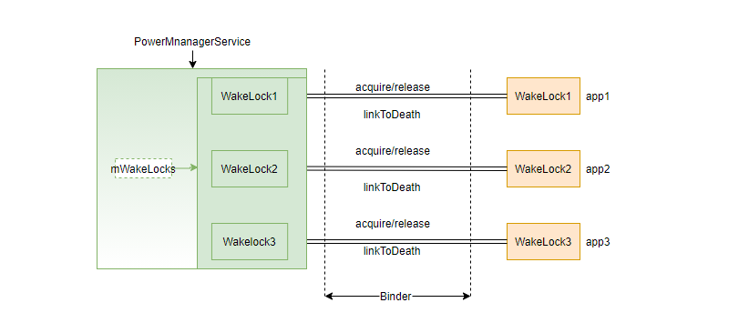

## WakeLock简介

WakeLock是一种表示应用程序需要让设备继续运行的机制，下载文件或者听音乐等等，设备在灭屏状态下，还需要继续运行，如果设备进入休眠，听音乐突然停止了，不符合使用场景。Android设备通过WakeLock机制来管理系统否需要真正的进入休眠，应用程序根据不同的使用场景，申请对应的锁，应用程序获得了WakeLock锁，系统就待机不下去。

### example
```java
// 申请权限
android.permission.WAKE_LOCK

PowerManager pm = (PowerManager)mContext.getSystemService(Context.POWER_SERVICE);
PowerManager.WakeLock wl = pm.newWakeLock(PowerManager.PARTIAL_WAKE_LOCK, TAG);
// 获取锁
wl.acquire();
// ... do work...
// 释放锁
wl.release();
```

#### 加锁和解锁两种状态：
- 第一种是永久的锁住，这样的锁除非显式的放开，否则是不会解锁
- 第二种锁是超时锁，这种锁会在锁住后一段时间解锁， 通过handler发送一个延时消息释放锁
```java
public void acquire() {
	synchronized (mToken) {
		acquireLocked();
	}
}

public void acquire(long timeout) {
	synchronized (mToken) {
		acquireLocked();
		// 通过handler发送一个延时消息释放锁
		mHandler.postDelayed(mReleaser, timeout);
	}
}
```

```java
WakeLock(int flags, String tag, String packageName) {
	mFlags = flags;
	mTag = tag;
	mPackageName = packageName;
	// 创建Binder服务端，通过acquire函数传递给PowerManagerService, PowerManagerService拿到的是mToken的代理对象
	mToken = new Binder();
	mTraceName = "WakeLock (" + mTag + ")";
}
```

### 常见的锁的类型
```java
// 对应Wakelock中的mFlags成员变量
PowerManager.PARTIAL_WAKE_LOCK
PowerManager.FULL_WAKE_LOCK
PowerManager.SCREEN_BRIGHT_WAKE_LOCK
PowerManager.SCREEN_DIM_WAKE_LOCK
PowerManager.PROXIMITY_SCREEN_OFF_WAKE_LOCK
PowerManager.DOZE_WAKE_LOCK
PowerManager.DRAW_WAKE_LOCK
```

### setReferenceCounted
设置此唤醒锁是否为引用计数。默认为true，acquire多次，release也得多次。mRefCounted为false则acquire多次，只需要release一次。
```java
public void setReferenceCounted(boolean value) {
	synchronized (mToken) {
		mRefCounted = value;
	}
}
```

```java
private void acquireLocked() {
	mInternalCount++;
	mExternalCount++;
	// 根据mRefCounted判断是否为引用计数
	if (!mRefCounted || mInternalCount == 1) {
		mHandler.removeCallbacks(mReleaser);
		Trace.asyncTraceBegin(Trace.TRACE_TAG_POWER, mTraceName, 0);
		try {
			mService.acquireWakeLock(mToken, mFlags, mTag, mPackageName, mWorkSource,
					mHistoryTag);
		} catch (RemoteException e) {
			throw e.rethrowFromSystemServer();
		}
		mHeld = true;
	}
}

public void release(int flags) {
	synchronized (mToken) {
		// 根据mRefCounted判断是否为引用计数
		if (!mRefCounted || mInternalCount == 0) {
			mHandler.removeCallbacks(mReleaser);
			if (mHeld) {
				Trace.asyncTraceEnd(Trace.TRACE_TAG_POWER, mTraceName, 0);
				try {
					mService.releaseWakeLock(mToken, flags);
				} catch (RemoteException e) {
					throw e.rethrowFromSystemServer();
				}
				mHeld = false;
			}
		}
	}
}
```

### 如何和PowerManagerService建立连接
PowerManagerService中有个内部类WakeLock和Powermanager中的WakeLock一一对应，应用程序调用PowerManager的acquire函数，最终通过Binder机制调用到PowerManagerService的acquireWakeLock函数，acquireWakeLock函数内部会判断mWakeLocks中是否存在对应的锁，不存在则创建，存在则更新，通知系统更新电源状态信息(updatePowerStateLocked) updateWakeLockSummaryLocked函数收集mWakeLocks中的锁类型，更新到变量mWakeLockSummary中。
<br><br>Android WakeLock和PMS对应关系图如下：



