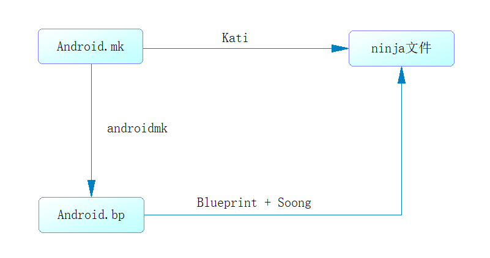

## ninja简介
早期的Android系统都是采用Android.mk的配置来编译源码，从Android 7.0开始引入ninja。ninja是一个编译框架，会根据相应的ninja格式的配置文件进行编译，使用ninja的主要目的是用来加快Android源码的编译速度

## Android.bp
Android.bp的出现就是为了替换Android.mk文件。bp跟mk文件不同，它是纯粹的配置，没有分支、循环等流程控制，不能做算数逻辑运算。如果需要控制逻辑，那么只能通过Go语言编写。

## Soong
Soong类似于之前的Makefile编译系统的核心，负责提供Android.bp语义解析，并将之转换成Ninja文件。Soong还会编译生成一个androidmk命令，用于将Android.mk文件转换为Android.bp文件，不过这个转换功能仅限于没有分支、循环等流程控制的Android.mk才有效。

## Blueprint
Blueprint是生成、解析Android.bp的工具，是Soong的一部分。Soong负责Android编译而设计的工具，而Blueprint只是解析文件格式，Soong解析内容的具体含义。Blueprint和Soong都是由Golang写的项目，从Android 7.0，prebuilts/go/目录下新增Golang所需的运行环境，在编译时使用。

## Kati
kati是专为Android开发的一个基于Golang和C++的工具，主要功能是把Android中的Android.mk文件转换成Ninja文件。代码路径是build/kati/，编译后的产物是ckati。

## Android中的ninja程序
```java
prebuilts/build-tools/linux-x86/bin/ninja
```

## Android中编译生成的ninja文件
```java
out/soong/build.ninja
out/soong/.bootstrap/build.ninja
out/soong/.bootstrap/build-globs.ninja
out/soong/.minibootstrap/build.ninja
out/soong/.minibootstrap/build-globs.ninja
out/combined-<product_name>.ninja
out/build-87939e401eb63e7a3ee5d558a8d326e2.ninja
out/build-<product_name>-package.ninja
out/build-87939e401eb63e7a3ee5d558a8d326e2-cleanspec.ninja
```

## 转换关系
```
通过Kati将Android.mk转换成ninja格式的文件
通过Blueprint + Soong将Android.bp转换成ninja格式的文件
通过androidmk将Android.mk转换成Android.bp，但针对没有分支、循环等流程控制的Android.mk才有效。
```

转换关系图如下：<br><br>



```java
Android.bp
-------------------------------------
cc_library_shared {
    name: "libinbp",
}

cc_binary {
    name: "binaryinbp",
    srcs: ["main.cpp"],
    shared_libs: [
        "libinbp",
        "libinmake"       // This is not possible, building gives error: binaryinbp" depends on undefined module "libinmake"
    ]
}

Android.mk
-------------------------------------
include $(CLEAR_VARS)
LOCAL_MODULE := libinmake
include $(BUILD_SHARED_LIBRARY)

include $(CLEAR_VARS)
LOCAL_SRC_FILES := main.cpp
LOCAL_MODULE := binaryinmake
LOCAL_SHARED_LIBRARIES := \
    libinmake \
    libinbp
include $(BUILD_EXECUTABLE)
```


## 常见用法

```java
// 在增量编译方面，ninja比make单独编译某个模块快很多，常见的模块有apk jar包等
prebuilts/build-tools/linux-x86/bin/ninja -f out/build-<product_name>.ninja ${model_name}
// example 1
prebuilts/build-tools/linux-x86/bin/ninja -f out/build-<product_name>.ninja services
// example 2
prebuilts/build-tools/linux-x86/bin/ninja -f out/build-<product_name>.ninja Launcher3

// 链接文件方便编译
ln -s prebuilts/build-tools/linux-x86/bin/ninja ninja
ln -s out/combined-aosp_arm64.ninja build.ninja
ninja -f build.ninja ${model_name}
```

## google Soong介绍
https://source.android.google.cn/setup/build
