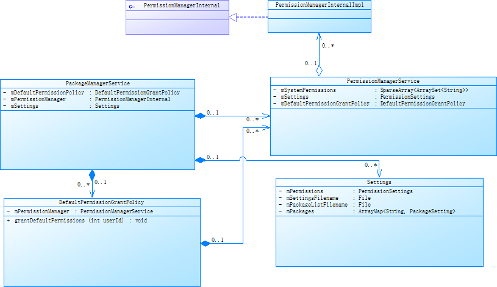
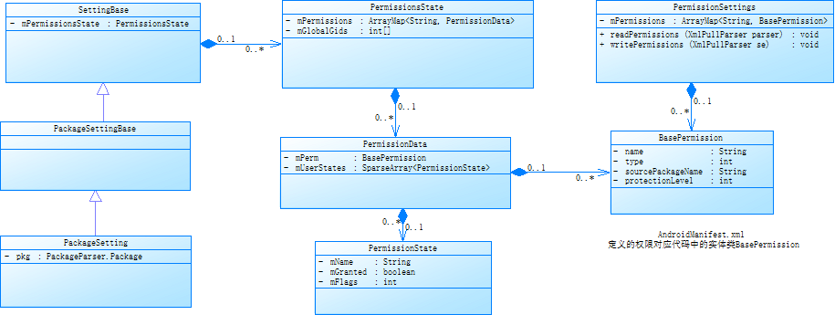

Android6.0之前，设备上安装的软件只要在AndroidManifest.xml中声明了的权限就可以拥有那些权限(安装时权限)， 6.0以及之后增加运行时权限，不但要AndroidManifest.xml中声明，APK运行时通过弹窗提示用户是否给予授权

### 授权和撤销
PackageManager提供了grantRuntimePermission/revokeRuntimePermission接口用来授权和撤销授权。这些权限一般是PROTECTION_DANGEROUS类型
```java
// PackageManager
grantRuntimePermission

revokeRuntimePermission
```

### APK申请运行时权限
```java
if (ActivityCompat.checkSelfPermission(this, Manifest.permission.WRITE_EXTERNAL_STORAGE) != PackageManager.PERMISSION_GRANTED) {
    //没有就进行申请
    ActivityCompat.requestPermissions(this, new String[]{Manifest.permission.WRITE_EXTERNAL_STORAGE}, PERMISSION_REQUEST_CODE);
}
```

Android权限管理的具体实现为PackageManagerService和PermissionManagerService，PackageManagerService也是Android系统的中的核心服务，主要有APK安装卸载，为APK分配userId, 权限管理，dex优化，四大组件查询等等功能

- 权限相关类图关系如下：






### 权限位置
- 系统权限: frameworks/base/core/res/AndroidManifest.xml
- 应用权限: 定义在应用的AndroidManifest.xml

Android系统中权限主要有以下四种：
```java
PROTECTION_NORMAL 普通权限（网络，蓝牙使用等）
PROTECTION_DANGEROUS 危险权限（位置信息获取，联系人获取等）
PROTECTION_SIGNATURE 系统签名权限
PROTECTION_SIGNATURE_OR_SYSTEM system/priv-app下且系统签名权限
```

```java
public class PermissionInfo extends PackageItemInfo implements Parcelable {

    public static final int PROTECTION_NORMAL = 0;

    public static final int PROTECTION_DANGEROUS = 1;

    public static final int PROTECTION_SIGNATURE = 2;

    public static final int PROTECTION_SIGNATURE_OR_SYSTEM = 3;
}
```

### 权限功能分析
PackageManagerService的创建过程:
- 1 首先创建了mPermissionManager对象
- 2 给mDefaultPermissionPolicy赋值，DefaultPermissionPolicy对象是在PermissionManagerService的构造函数中创建
- 3 然后创建Settings对象，Setting对象用来记录安装信息，下次开机重启恢复应用的安装信息，运行时权限授权记录的登记
- 4 通过mSettings.readLPw读取上次安装信息，授权信息
- 5 扫描APK目录， 安装APK， 会收集AndroidManifest.xml中的权限信息
- 6 通过mPermissionManager.updateAllPermissions来更新权限信息
- 7 mSettings.writeLPr()将安装信息，授权信息写到文件
```java
public PackageManagerService(Context context, Installer installer,
            boolean factoryTest, boolean onlyCore) {
	synchronized (mPackages) {
		// Expose private service for system components to use.
		LocalServices.addService(
				PackageManagerInternal.class, new PackageManagerInternalImpl());
		/* 1 mPermissionManager对应的实现为PermissionManagerService的内部类PermissionManagerInternalImpl，
			方便systemServer进程自己内部调用PermissionManagerService的接口
		*/
		mPermissionManager = PermissionManagerService.create(context,
				new DefaultPermissionGrantedCallback() {
					@Override
					public void onDefaultRuntimePermissionsGranted(int userId) {
						synchronized(mPackages) {
							mSettings.onDefaultRuntimePermissionsGrantedLPr(userId);
						}
					}
				}, mPackages /*externalLock*/);
		/* 2 获取默认的权限策略，和运行时权限相关 */
		mDefaultPermissionPolicy = mPermissionManager.getDefaultPermissionGrantPolicy();

		/* 3 创建Settings对象，Setting对象用来记录安装信息，下次开机重启恢复应用的安装信息，授权记录的登记等 */
		mSettings = new Settings(mPermissionManager.getPermissionSettings(), mPackages);
	}

	/* 4 读取上一次安装信息 */
	mFirstBoot = !mSettings.readLPw(sUserManager.getUsers(false));

	/* 5 扫描system,vendor, data目录下的apk,读取apk中的 */
	scanDirTracedLI();

	/* 6 更新权限，给某些apk授权 */
	mPermissionManager.updateAllPermissions(
		StorageManager.UUID_PRIVATE_INTERNAL, sdkUpdated, mPackages.values(),
		mPermissionCallback);

	/* 7 将相关权限信息写入文件 */
	mSettings.writeLPr();
}
```

#### PermissionManagerService::create
create函数中，先判断是否存在PermissionManagerInternal对象，没有则创建PermissionManagerService对象，PermissionManagerInternal对象是在PermissionManagerService中添加到LocalServices中的
```java
public static PermissionManagerInternal PermissionManagerService::create(Context context,
		@Nullable DefaultPermissionGrantedCallback defaultGrantCallback,
		@NonNull Object externalLock) {
	final PermissionManagerInternal permMgrInt =
			LocalServices.getService(PermissionManagerInternal.class);
	if (permMgrInt != null) {
		return permMgrInt;
	}
	/* 1 创建PermissionManagerService对象，PermissionManagerService对象负责主要的权限管理工作 */
	new PermissionManagerService(context, defaultGrantCallback, externalLock);
	return LocalServices.getService(PermissionManagerInternal.class);
}
```

#### PermissionManagerService
PermissionManagerService的创建过程:
- 1 创建PermissionSettings对象，PermissionSettings记录所有权限相关信息
- 2 创建mDefaultPermissionPolicy对象
- 3 解析system/etc/platform.xml中和权限对应的uid, 每条记录对应一个SystemConfig.PermissionEntry对象
- 4 检查权限信息是否在PermissionSettings已经存在，不存在则创建BasePermission对象，并添加到PermissionSettings的成员变量mPermissions中
- 5 创建PermissionManagerInternalImpl对象，添加到LocalServices中，PermissionManagerInternalImpl为PermissionManagerService内部类
```java
PermissionManagerService(Context context,
            @Nullable DefaultPermissionGrantedCallback defaultGrantCallback,
            @NonNull Object externalLock) {
	/* 1 创建PermissionSettings对象 */
	mSettings = new PermissionSettings(context, mLock);
	/* 2 创建DefaultPermissionGrantPolicy对象 */
	mDefaultPermissionGrantPolicy = new DefaultPermissionGrantPolicy(
			context, mHandlerThread.getLooper(), defaultGrantCallback, this);
	/* 3 获取系统配置信息 system/etc/platform.xml等等文件中获取 */
	SystemConfig systemConfig = SystemConfig.getInstance();
	mSystemPermissions = systemConfig.getSystemPermissions();
	mGlobalGids = systemConfig.getGlobalGids();
	// propagate permission configuration
	/* 4 PermissionEntry对象对应 system/etc/platform.xml的一个permission项 */
	final ArrayMap<String, SystemConfig.PermissionEntry> permConfig =
			SystemConfig.getInstance().getPermissions();
	synchronized (mLock) {
		for (int i=0; i<permConfig.size(); i++) {
			final SystemConfig.PermissionEntry perm = permConfig.valueAt(i);
			BasePermission bp = mSettings.getPermissionLocked(perm.name);
			if (bp == null) {
				// add to mSettings
				bp = new BasePermission(perm.name, "android", BasePermission.TYPE_BUILTIN);
				/* 将权限信息存入PermissionSettings中的mPermissions属性中*/
				mSettings.putPermissionLocked(perm.name, bp);
			}
			if (perm.gids != null) {
				bp.setGids(perm.gids, perm.perUser);
			}
		}
	}
	/* 创建PermissionManagerInternalImpl对象，并添加到LocalServices中 */
	LocalServices.addService(PermissionManagerInternal.class, new PermissionManagerInternalImpl());
}
```

```java
SystemConfig() {
	// Read configuration from system
	/* 读取配置文件，system/etc/platform.xml */
	readPermissions(Environment.buildPath(
			Environment.getRootDirectory(), "etc", "sysconfig"), ALLOW_ALL);

	// Read configuration from the old permissions dir
	readPermissions(Environment.buildPath(
			Environment.getRootDirectory(), "etc", "permissions"), ALLOW_ALL);
}
```

#### system/etc/platform.xml
```java
<?xml version="1.0" encoding="utf-8"?>
<permissions>
    <permission name="android.permission.BLUETOOTH_ADMIN" >
        <group gid="net_bt_admin" />
    </permission>

    <permission name="android.permission.BLUETOOTH" >
        <group gid="net_bt" />
    </permission>

    <permission name="android.permission.READ_EXTERNAL_STORAGE" />
    <permission name="android.permission.WRITE_EXTERNAL_STORAGE" />

    <assign-permission name="android.permission.MODIFY_AUDIO_SETTINGS" uid="media" />

</permissions>
```

#### gid数字对应定义在android_filesystem_config.h
```c
#define AID_SYSTEM 1000 /* system server */
#define AID_NET_BT_ADMIN 3001 /* bluetooth: create any socket */
#define AID_NET_BT 3002       /* bluetooth: create sco, rfcomm or l2cap sockets */
#define AID_INET 3003         /* can create AF_INET and AF_INET6 sockets */
#define AID_NET_RAW 3004      /* can create raw INET sockets */
#define AID_NET_ADMIN 3005    /* can configure interfaces and routing tables. */
#define AID_NET_BW_STATS 3006 /* read bandwidth statistics */
#define AID_NET_BW_ACCT 3007  /* change bandwidth statistics accounting */
#define AID_READPROC 3009     /* Allow /proc read access */
#define AID_WAKELOCK 3010     /* Allow system wakelock read/write access */
#define AID_UHID 3011         /* Allow read/write to /dev/uhid node */
```


#### 将对应权限的gid(组ID)添加到对应的PermissionEntry对象中
```java
void SystemConfig::readPermission(XmlPullParser parser, String name)
		throws IOException, XmlPullParserException {
	final boolean perUser = XmlUtils.readBooleanAttribute(parser, "perUser", false);
	final PermissionEntry perm = new PermissionEntry(name, perUser);
	mPermissions.put(name, perm);

	int outerDepth = parser.getDepth();
	int type;
	while ((type=parser.next()) != XmlPullParser.END_DOCUMENT
		   && (type != XmlPullParser.END_TAG
				   || parser.getDepth() > outerDepth)) {
		String tagName = parser.getName();
		if ("group".equals(tagName)) {
			String gidStr = parser.getAttributeValue(null, "gid");
			if (gidStr != null) {
				int gid = Process.getGidForName(gidStr);
				/* 给对应的权限设置相应的gids */
				perm.gids = appendInt(perm.gids, gid);
			} else {
				Slog.w(TAG, "<group> without gid at "
						+ parser.getPositionDescription());
			}
		}
		XmlUtils.skipCurrentTag(parser);
	}
}
```

#### Settings
Settings类主要职责将安装信息保存到packages.xml和packages.list中，运行时权限保存在runtime-permissions.xml中
```java
Settings(File dataDir, PermissionSettings permission, Object lock) {
	mLock = lock;
	mPermissions = permission;
	/* mSettingsFilename存放apk安装信息，权限相关为主 */
	mSettingsFilename = new File(mSystemDir, "packages.xml");
	/* mPackageListFilename存放apk安装信息 uid,gids */
	mPackageListFilename = new File(mSystemDir, "packages.list");

}
```

#### /data/system/packages.xml
```c
<?xml version='1.0' encoding='utf-8' standalone='yes' ?>
<packages>

    <!-- 保存的所有权限，以及所在的包名，系统权限包名为android -->
    <permissions>
      <item name="android.permission.REAL_GET_TASKS" package="android" protection="18" />
      <item name="android.permission.ACCESS_CACHE_FILESYSTEM" package="android" protection="18" />
    </permissions>

    <!-- com.mediatek.mtklogger apk信息 -->
    <package name="com.mediatek.mtklogger" codePath="/system/app/MTKLogger" nativeLibraryPath="/system/app/MTKLogger/lib" publicFlags="805879365" privateFlags="0" ft="11e8dc5d800" it="11e8dc5d800" ut="11e8dc5d800" version="40000" userId="10087" isOrphaned="true">
        <sigs count="1" schemeVersion="3">
            <cert index="0" />
        </sigs>
        <perms>
            <item name="android.permission.SYSTEM_ALERT_WINDOW" granted="true" flags="0" />
            <item name="android.permission.FOREGROUND_SERVICE" granted="true" flags="0" />
        </perms>
        <proper-signing-keyset identifier="1" />
    </package>
</packages>
```

####  /data/system/packages.list
apk安装信息uid,gids
```c
com.android.fmradio 10018 0 /data/user/0/com.android.fmradio platform:privapp:targetSdkVersion=28 3002,1013
com.mediatek.gba 1001 0 /data/user/0/com.mediatek.gba platform:privapp:targetSdkVersion=28 1065,3002,1023,3003,3001,3007,1002,3010,3011,3006
com.mediatek.ims 1001 0 /data/user/0/com.mediatek.ims platform:privapp:targetSdkVersion=28 1065,3002,1023,3003,3001,3007,1002,3010,3011,3006
```

#### readLPw
- 1 解析package.xml
- 2 解析runtime-permissions.xml
```java
boolean Settings::readLPw(@NonNull List<UserInfo> users) {
	str = new FileInputStream(mSettingsFilename);
	if (tagName.equals("permissions")) {
		// all mPermissions
		/* 读取package.xml中的permissions tag下的所有权限信息 */
		mPermissions.readPermissions(parser);
	}

	for (UserInfo user : users) {
		/* 读取runtime-permissions.xml中的runtime-permissions tag下的所有权限信息 */
		mRuntimePermissionsPersistence.readStateForUserSyncLPr(user.id);
	}
}
```

readPermissions最终调用到BasePermission的readLPw函数，mPermissions中是否存在对应的bp对象， 不存在则创建BasePermission对象，根据dynamic字段来确认是TYPE_DYNAMIC或TYPE_NORMAL类型，将填充好数据的BasePermission对象保存到mPermissions中
```java
public static boolean BasePermission::readLPw(@NonNull Map<String, BasePermission> out,
            @NonNull XmlPullParser parser) {
	final String tagName = parser.getName();
	/* <item name="android.permission.READ_EXTERNAL_STORAGE" granted="true" flags="0" /> */
	if (!tagName.equals(TAG_ITEM)) {
		return false;
	}
	final String name = parser.getAttributeValue(null, ATTR_NAME);
	final String sourcePackage = parser.getAttributeValue(null, ATTR_PACKAGE);
	final String ptype = parser.getAttributeValue(null, "type");
	if (name == null || sourcePackage == null) {
		PackageManagerService.reportSettingsProblem(Log.WARN,
				"Error in package manager settings: permissions has" + " no name at "
						+ parser.getPositionDescription());
		return false;
	}
	final boolean dynamic = "dynamic".equals(ptype);
	/* mPermissions中是否存在对应的bp对象 */
	BasePermission bp = out.get(name);
	// If the permission is builtin, do not clobber it.
	/* 系统中还没有这个权限，则创建一个对应的BasePermission */
	if (bp == null || bp.type != TYPE_BUILTIN) {
		bp = new BasePermission(name.intern(), sourcePackage,
				dynamic ? TYPE_DYNAMIC : TYPE_NORMAL);
	}
	bp.protectionLevel = readInt(parser, null, "protection",
			PermissionInfo.PROTECTION_NORMAL);
	bp.protectionLevel = PermissionInfo.fixProtectionLevel(bp.protectionLevel);
	if (dynamic) {
		final PermissionInfo pi = new PermissionInfo();
		pi.packageName = sourcePackage.intern();
		pi.name = name.intern();
		pi.icon = readInt(parser, null, "icon", 0);
		pi.nonLocalizedLabel = parser.getAttributeValue(null, "label");
		pi.protectionLevel = bp.protectionLevel;
		bp.pendingPermissionInfo = pi;
	}
	/* 将bp对象添加到PermissionSettings的mPermissions中 */
	out.put(bp.name, bp);
	return true;
}
```

#### readStateForUserSyncLPr
```java
public void RuntimePermissionPersistence::readStateForUserSyncLPr(int userId) {
	/* getUserRuntimePermissionsFile 文件对应runtime-permissions.xml */
	File permissionsFile = getUserRuntimePermissionsFile(userId);
	if (!permissionsFile.exists()) {
		return;
	}

	FileInputStream in;
	try {
		in = new AtomicFile(permissionsFile).openRead();
	} catch (FileNotFoundException fnfe) {
		Slog.i(PackageManagerService.TAG, "No permissions state");
		return;
	}

	try {
		XmlPullParser parser = Xml.newPullParser();
		parser.setInput(in, null);
		/* 解析runtime-permissions.xml */
		parseRuntimePermissionsLPr(parser, userId);

	} catch (XmlPullParserException | IOException e) {
		throw new IllegalStateException("Failed parsing permissions file: "
				+ permissionsFile , e);
	} finally {
		IoUtils.closeQuietly(in);
	}
}
```

#### parseRuntimePermissionsLPr
```java
private void RuntimePermissionPersistence::parseRuntimePermissionsLPr(XmlPullParser parser, int userId)
                throws IOException, XmlPullParserException {
	switch (parser.getName()) {
		/* TAG_PACKAGE = "pkg"; */
		case TAG_PACKAGE: {
			String name = parser.getAttributeValue(null, ATTR_NAME);
			PackageSetting ps = mPackages.get(name);
			if (ps == null) {
				Slog.w(PackageManagerService.TAG, "Unknown package:" + name);
				XmlUtils.skipCurrentTag(parser);
				continue;
			}

			/* 解析tag为pkg下的item */
			parsePermissionsLPr(parser, ps.getPermissionsState(), userId);
		} break;
	}
}
```

#### parsePermissionsLPr
从runtime-permissions.xml中解析出对应的apk是否已经授权过，如果用户之前授权过，则直接授权（相当于把上次用户授权过的信息读取出来授权），并更新mUserStates相关权限信息，否则只更新mUserStates相关权限信息
```java
 private void RuntimePermissionPersistence::parsePermissionsLPr(XmlPullParser parser, PermissionsState permissionsState,
                int userId) throws IOException, XmlPullParserException {
	final int outerDepth = parser.getDepth();
	int type;
	while ((type = parser.next()) != XmlPullParser.END_DOCUMENT
			&& (type != XmlPullParser.END_TAG || parser.getDepth() > outerDepth)) {
		if (type == XmlPullParser.END_TAG || type == XmlPullParser.TEXT) {
			continue;
		}

		switch (parser.getName()) {
			case TAG_ITEM: {
				String name = parser.getAttributeValue(null, ATTR_NAME);
				BasePermission bp = mPermissions.getPermission(name);
				if (bp == null) {
					Slog.w(PackageManagerService.TAG, "Unknown permission:" + name);
					XmlUtils.skipCurrentTag(parser);
					continue;
				}

				String grantedStr = parser.getAttributeValue(null, ATTR_GRANTED);
				/* <item name="android.permission.READ_EXTERNAL_STORAGE" granted="true" flags="0" /> */
				/* 读取granted的值 */
				final boolean granted = grantedStr == null
						|| Boolean.parseBoolean(grantedStr);

				String flagsStr = parser.getAttributeValue(null, ATTR_FLAGS);
				final int flags = (flagsStr != null)
						? Integer.parseInt(flagsStr, 16) : 0;

				if (granted) {
					/* 如果之前授权过，则直接授权 */
					permissionsState.grantRuntimePermission(bp, userId);
					/* 更新mUserStates相关权限信息 */
					permissionsState.updatePermissionFlags(bp, userId,
								PackageManager.MASK_PERMISSION_FLAGS, flags);
				} else {
					permissionsState.updatePermissionFlags(bp, userId,
							PackageManager.MASK_PERMISSION_FLAGS, flags);
				}

			} break;
		}
	}
}
```

#### parseBaseApkCommon
apk中的AndroidManifest.xml中也有权限，解析AndroidManifest.xml中的权限位置发生在扫描apk安装过程中， 然后将apk中的权限合并到mPermissions中
，我们只分析apk的扫描关键部分
1 一个apk对应一个pkg对象
2 apk中所有定义的权限会保存在permissions列表中
3 apk中用户请求的权限会保存在requestedPermissions列表中
```java
private Package PackageParser::parseBaseApkCommon(Package pkg, Set<String> acceptedTags, Resources res,
	XmlResourceParser parser, int flags, String[] outError) throws XmlPullParserException,
	IOException {
	 /* 一个apk对应一个pkg对象 */
	 if (tagName.equals(TAG_PERMISSION)) {
		/* 解析pkg中定义的权限 */
		if (!parsePermission(pkg, res, parser, outError)) {
			return null;
		}
	} else if (tagName.equals(TAG_PERMISSION_TREE)) {
		if (!parsePermissionTree(pkg, res, parser, outError)) {
			return null;
		}
	} else if (tagName.equals(TAG_USES_PERMISSION)) {
		/* <uses-permission android:name="android.permission.INTERNET" /> */
		/* 解析pkg中使用的权限 */
		if (!parseUsesPermission(pkg, res, parser)) {
			return null;
		}
	}
}
```

#### parsePermission
为对应的权限创建一个Permission对象， 并将Permission对象添加到pkg中的permissions列表中
```java
private boolean PackageParser::parsePermission(Package owner, Resources res,
            XmlResourceParser parser, String[] outError)
        throws XmlPullParserException, IOException {
	/* 创建Permission对象 */
	Permission perm = new Permission(owner);
	/* 将定义的权限添加到pkg对象中 */
	owner.permissions.add(perm);
    return true;
}
```


#### commitPackageSettings
apk安装信息解析完后，把pkg中的安装信息合并到PermissionSettings，apk中的permissions添加到PermissionSettings的mPermissions中
```java
private void PackageManagerService::commitPackageSettings(PackageParser.Package pkg,
            @Nullable PackageParser.Package oldPkg, PackageSetting pkgSetting, UserHandle user,
            final @ScanFlags int scanFlags, boolean chatty) {
	/* 把pkg，即apk中的permissions合并到PermissionSettings的mPermissions中 */
	/* addAllPermissions调用的PermissionManagerService中的addAllPermissions方法 */
	mPermissionManager.addAllPermissions(pkg, chatty);
}
```


#### addAllPermissions
遍历apk中的权限信息，去重后，将bp对象添加到mSettings中
```java
private void PermissionManagerService::addAllPermissions(PackageParser.Package pkg, boolean chatty) {
	final int N = pkg.permissions.size();
	for (int i=0; i<N; i++) {
		PackageParser.Permission p = pkg.permissions.get(i);

		// Assume by default that we did not install this permission into the system.
		p.info.flags &= ~PermissionInfo.FLAG_INSTALLED;

		synchronized (PermissionManagerService.this.mLock) {
			if (p.tree) {
				final BasePermission bp = BasePermission.createOrUpdate(
						mSettings.getPermissionTreeLocked(p.info.name), p, pkg,
						mSettings.getAllPermissionTreesLocked(), chatty);
				/* 把bp对象添加到PermissionSettings的mPermissionGroups中 */
				mSettings.putPermissionTreeLocked(p.info.name, bp);
			} else {
				/* 去重 */
				final BasePermission bp = BasePermission.createOrUpdate(
						mSettings.getPermissionLocked(p.info.name),
						p, pkg, mSettings.getAllPermissionTreesLocked(), chatty);
				/* 把bp对象添加到PermissionSettings的mPermissions中 */
				mSettings.putPermissionLocked(p.info.name, bp);
			}
		}
	}
}
```

#### updateAllPermissions
sdk没有升级的情况下flags为UPDATE_PERMISSIONS_ALL,接下来我们分析updatePermissions函数
```java
private void PermissionManagerService::updateAllPermissions(String volumeUuid, boolean sdkUpdated,
		Collection<PackageParser.Package> allPackages, PermissionCallback callback) {
	final int flags = UPDATE_PERMISSIONS_ALL |
			(sdkUpdated
					? UPDATE_PERMISSIONS_REPLACE_PKG | UPDATE_PERMISSIONS_REPLACE_ALL
					: 0);
	updatePermissions(null, null, volumeUuid, flags, allPackages, callback);
}
```

#### updatePermissions
updateAllPermissions中传入的参数可知，changingPkgName和changingPkg都为null, changingPkg为空，接下来调用grantPermissions函数给apk授权
```java
private void PermissionManagerService::updatePermissions(String changingPkgName, PackageParser.Package changingPkg,
		String replaceVolumeUuid, int flags, Collection<PackageParser.Package> allPackages,
		PermissionCallback callback) {
	/* changingPkgName = null, changingPkg = null, flags = UPDATE_PERMISSIONS_ALL */
	flags = updatePermissionTrees(changingPkgName, changingPkg, flags);
	/* 更新权限，回过头来又是调用updatePermissions的重载函数 */
	flags = updatePermissions(changingPkgName, changingPkg, flags);

	Trace.traceBegin(TRACE_TAG_PACKAGE_MANAGER, "grantPermissions");
	if ((flags & UPDATE_PERMISSIONS_ALL) != 0) {
		for (PackageParser.Package pkg : allPackages) {
			if (pkg != changingPkg) {
				// Only replace for packages on requested volume
				final String volumeUuid = getVolumeUuidForPackage(pkg);
				final boolean replace = ((flags & UPDATE_PERMISSIONS_REPLACE_ALL) != 0)
						&& Objects.equals(replaceVolumeUuid, volumeUuid);
				/* 给apk授权 */
				grantPermissions(pkg, replace, changingPkgName, callback);
			}
		}
	}

	if (changingPkg != null) {
		// Only replace for packages on requested volume
		final String volumeUuid = getVolumeUuidForPackage(changingPkg);
		final boolean replace = ((flags & UPDATE_PERMISSIONS_REPLACE_PKG) != 0)
				&& Objects.equals(replaceVolumeUuid, volumeUuid);

		grantPermissions(changingPkg, replace, changingPkgName, callback);
	}
	Trace.traceEnd(TRACE_TAG_PACKAGE_MANAGER);
}
```

#### grantPermissions
遍历pkg中的requestedPermissions，根据不同类型做不同的处理， 普通权限直接授予安装时权限，运行时权限则根据用户之前是否授权过（状态从runtime-permissions.xml中读取），系统权限验证签名相关信息直接给予安装时权限,通过callback最后将信息写入runtime-permissions.xml中
```java
private void PermissionManagerService::grantPermissions(PackageParser.Package pkg, boolean replace,
            String packageOfInterest, PermissionCallback callback) {

    final PackageSetting ps = (PackageSetting) pkg.mExtras;
    if (ps == null) {
        return;
    }
	/* 一个pkg对应一个PermissionsState对象 */
    final PermissionsState permissionsState = ps.getPermissionsState();
    PermissionsState origPermissions = permissionsState;

    final int[] currentUserIds = UserManagerService.getInstance().getUserIds();

    boolean runtimePermissionsRevoked = false;
    int[] updatedUserIds = EMPTY_INT_ARRAY;

    boolean changedInstallPermission = false;
    permissionsState.setGlobalGids(mGlobalGids);

    synchronized (mLock) {
        final int N = pkg.requestedPermissions.size();
        /// M: CTA requirement - permission control
        boolean pkgReviewRequired = isPackageNeedsReview(pkg,  ps.getSharedUser());

        for (int i = 0; i < N; i++) {
            final String permName = pkg.requestedPermissions.get(i);
            final BasePermission bp = mSettings.getPermissionLocked(permName);
            final boolean appSupportsRuntimePermissions =
                    pkg.applicationInfo.targetSdkVersion >= Build.VERSION_CODES.M;
            final String perm = bp.getName();
            boolean allowedSig = false;
            int grant = GRANT_DENIED;

            if (bp.isNormal()) {
                // For all apps normal permissions are install time ones.
				/* 安装权限 */
                grant = GRANT_INSTALL;
            } else if (bp.isRuntime()) {
                // If a permission review is required for legacy apps we represent
                // their permissions as always granted runtime ones since we need
                // to keep the review required permission flag per user while an
                // install permission's state is shared across all users.
                if (!appSupportsRuntimePermissions && !mSettings.mPermissionReviewRequired) {
                    // For legacy apps dangerous permissions are install time ones.
                    grant = GRANT_INSTALL;
                } else if (origPermissions.hasInstallPermission(bp.getName())) {
                    // For legacy apps that became modern, install becomes runtime.
                    grant = GRANT_UPGRADE;
                } else if (isLegacySystemApp) {
                    // For legacy system apps, install becomes runtime.
                    // We cannot check hasInstallPermission() for system apps since those
                    // permissions were granted implicitly and not persisted pre-M.
                    grant = GRANT_UPGRADE;
                } else {
                    // For modern apps keep runtime permissions unchanged.
					/* 运行时权限 */
                    grant = GRANT_RUNTIME;
                }
            } else if (bp.isSignature()) {
                // For all apps signature permissions are install time ones.
                allowedSig = grantSignaturePermission(perm, pkg, bp, origPermissions);
                if (allowedSig) {
                    grant = GRANT_INSTALL;
                }
            }

            switch (grant) {
                case GRANT_INSTALL: {
                    for (int userId : UserManagerService.getInstance().getUserIds()) {
                        if (origPermissions.getRuntimePermissionState(
                                perm, userId) != null) {
                            // Revoke the runtime permission and clear the flags.
                            origPermissions.revokeRuntimePermission(bp, userId);
                            origPermissions.updatePermissionFlags(bp, userId,
                                  PackageManager.MASK_PERMISSION_FLAGS, 0);
                            // If we revoked a permission permission, we have to write.
                            updatedUserIds = ArrayUtils.appendInt(
                                    updatedUserIds, userId);
                        }
                    }

                    // Grant an install permission.
					/* 给安装权限 */
                    if (permissionsState.grantInstallPermission(bp) !=
                            PermissionsState.PERMISSION_OPERATION_FAILURE) {
                        changedInstallPermission = true;
                    }
                } break;

                case GRANT_RUNTIME: {
                    // Grant previously granted runtime permissions.
                    for (int userId : UserManagerService.getInstance().getUserIds()) {
						/* 使用之前授权的状态 ，状态从runtime-permissions.xml中读取 */
						final PermissionState permissionState = origPermissions
							.getRuntimePermissionState(perm, userId);
                        int flags = permissionState != null
                                ? permissionState.getFlags() : 0;
                        if (origPermissions.hasRuntimePermission(perm, userId)) {
                        }

                        // Propagate the permission flags.
                        permissionsState.updatePermissionFlags(bp, userId, flags, flags);
                    }
                } break;
            }
        }
    }

    if (callback != null) {
		/* 回调PackageManagerService中的onPermissionUpdated函数 */
        callback.onPermissionUpdated(updatedUserIds, runtimePermissionsRevoked);
    }
}
```


```java
public void PackageManagerService::onPermissionUpdated(int[] updatedUserIds, boolean sync) {
    synchronized (mPackages) {
        for (int userId : updatedUserIds) {
			/* 将运行时相关信息写入runtime-permissions.xml中 */
            mSettings.writeRuntimePermissionsForUserLPr(userId, sync);
        }
    }
}
```


#### writeLPr
将apk安装信息写入文件
```java
void Settings::writeLPr() {
	/* packages.xml */
    FileOutputStream fstr = new FileOutputStream(mSettingsFilename);
    BufferedOutputStream str = new BufferedOutputStream(fstr);

	serializer.startTag(null, "permissions");
	/* 权限信息写入 */
    mPermissions.writePermissions(serializer);
    serializer.endTag(null, "permissions");

	for (final PackageSetting pkg : mPackages.values()) {
		/* 写入pkg信息 */
		writePackageLPr(serializer, pkg);
    }

	/* 写入运行时权限 */
	writeAllRuntimePermissionsLPr();
}
```

#### systemReady
systemReady函数给某些系统apk授予运行时权限, 更新权限信息
```java
PackageManagerService::systemReady() {
	// If we upgraded grant all default permissions before kicking off.
	for (int userId : grantPermissionsUserIds) {
		/* 给默认系统某些apk授予特定的运行权限 */
		mDefaultPermissionPolicy.grantDefaultPermissions(userId);
	}

	synchronized (mPackages) {
		/* 再次进行对所有的apk授权更新 */
		mPermissionManager.updateAllPermissions(
			StorageManager.UUID_PRIVATE_INTERNAL, false, mPackages.values(),
			mPermissionCallback);
	}
}
```

#### DefaultPermissionGrantPolicy
DefaultPermissionGrantPolicy主要是给系统授予默认的运行时权限
```java
public void DefaultPermissionGrantPolicy::grantDefaultPermissions(int userId) {
    /* 给系统apk授运行时权限，以及给一些特定的apk授权 */
	grantPermissionsToSysComponentsAndPrivApps(userId);
    grantDefaultSystemHandlerPermissions(userId);
    grantDefaultPermissionExceptions(userId);
}
```

```java
private void DefaultPermissionGrantPolicy::grantPermissionsToSysComponentsAndPrivApps(int userId) {
    Log.i(TAG, "Granting permissions to platform components for user " + userId);
    final PackageList packageList = mServiceInternal.getPackageList();
    for (String packageName : packageList.getPackageNames()) {
        final PackageParser.Package pkg = mServiceInternal.getPackage(packageName);
        if (pkg == null) {
            continue;
        }
        // 不是系统apk等直接继续
        if (!isSysComponentOrPersistentPlatformSignedPrivApp(pkg)
                || !doesPackageSupportRuntimePermissions(pkg)
                || pkg.requestedPermissions.isEmpty()) {
            continue;
        }
		/* 给系统apk授运行时权限 */
        grantRuntimePermissionsForPackage(userId, pkg);
    }
}
```

```java
private void DefaultPermissionGrantPolicy::grantRuntimePermissionsForPackage(int userId, PackageParser.Package pkg) {
    Set<String> permissions = new ArraySet<>();
    for (String permission :  pkg.requestedPermissions) {
        final BasePermission bp = mPermissionManager.getPermission(permission);
        if (bp == null) {
            continue;
        }
        if (bp.isRuntime()) {
            permissions.add(permission);
        }
    }
    if (!permissions.isEmpty()) {
		/* 授权为true */
        grantRuntimePermissions(pkg, permissions, true, userId);
    }
}
```

```java
private void grantRuntimePermissions(PackageParser.Package pkg, Set<String> permissions,
				boolean systemFixed, boolean ignoreSystemPackage, int userId) {
		if (pkg.requestedPermissions.isEmpty()) {
				return;
		}

		List<String> requestedPermissions = pkg.requestedPermissions;
    Set<String> grantablePermissions = null;

		final int grantablePermissionCount = requestedPermissions.size();
    for (int i = 0; i < grantablePermissionCount; i++) {
       String permission = requestedPermissions.get(i);
			 /* mServiceInternal为PackageManagerInternal对象，实际调用为PackageManagerService的grantRuntimePermission函数 */
			 mServiceInternal.grantRuntimePermission(pkg.packageName, permission, userId, false);

			 int newFlags = PackageManager.FLAG_PERMISSION_GRANTED_BY_DEFAULT;
			 if (systemFixed) {
			   newFlags |= PackageManager.FLAG_PERMISSION_SYSTEM_FIXED;
			 }

			 mServiceInternal.updatePermissionFlagsTEMP(permission, pkg.packageName,
			       newFlags, newFlags, userId);
    }
}
```

```java
public void PackageManagerInternalImpl::updatePermissionFlagsTEMP(String permName, String packageName, int flagMask,
        int flagValues, int userId) {
    // 通知权限改变
    PackageManagerService.this.updatePermissionFlags(
            permName, packageName, flagMask, flagValues, userId);
}
```
